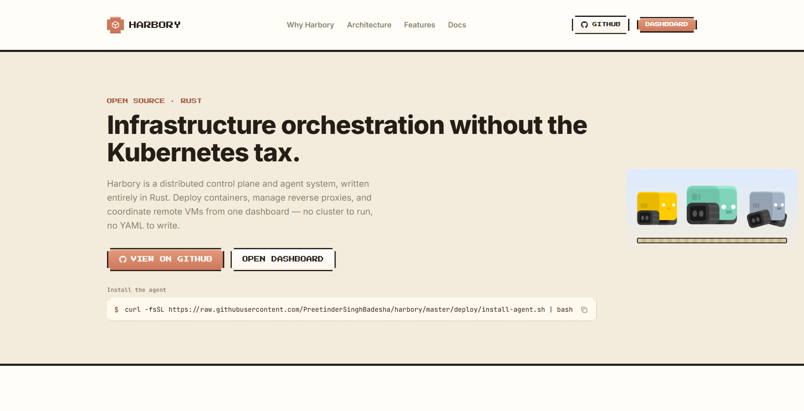
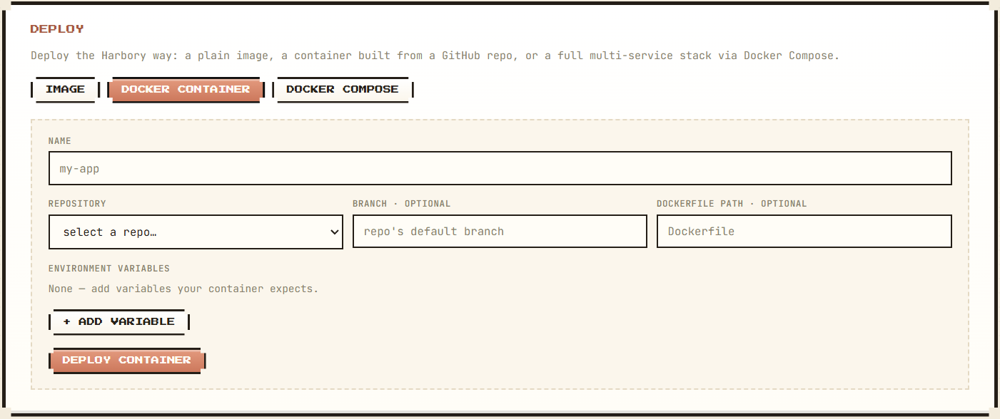
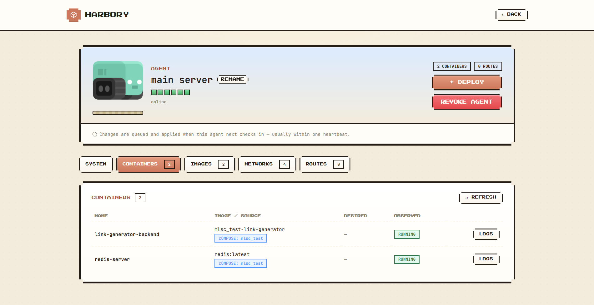
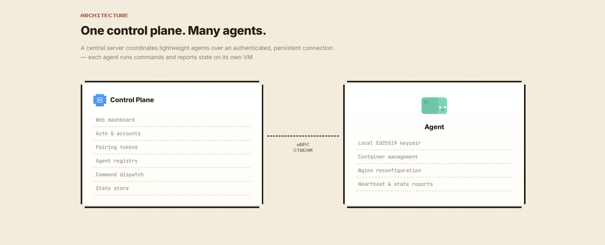

# Harbory

**Infrastructure orchestration without the Kubernetes tax.**

Harbory is a self-hosted control plane and lightweight agent, written entirely in Rust, for deploying and managing containers across your own VMs. Deploy straight from a GitHub repo — a single container or a full Docker Compose stack — manage reverse proxy routing, and watch every agent's containers, images, and networks from one dashboard. No cluster to run, no YAML to write.



---

## Why Harbory

- You have a handful of VMs and want simple, reliable container deployment — not a managed-PaaS bill and not a Kubernetes cluster to babysit.
- You want to deploy straight from a GitHub repo (single container or a full Compose stack) without wiring up a CI/CD pipeline.
- You want one dashboard that shows every agent's containers, images, networks, and system health, live.

## Features

- 🚀 **Deploy from a GitHub repo** — a single container (build + run) or a full Docker Compose stack, public or private repos via GitHub OAuth
- 🐳 **Docker-native management** — containers, images, and networks per agent, browsable like Docker Desktop
- 🔀 **Reverse proxy management** — declarative Nginx routing per agent, validated before every reload
- 🔐 **Zero-trust agent identity** — Ed25519-signed credentials and short-lived, single-use pairing tokens; no static API keys
- 📊 **Live system info** — CPU, memory, disk, uptime per agent
- 🕹️ **Real-time dashboard** — online/offline status, deployment status, and an audit log of security-relevant events
- 🔑 **Flexible sign-in** — email/password, GitHub, or Google, via Supabase

## Quickstart

**1. Run the control plane**
```bash
curl -fsSL https://raw.githubusercontent.com/PreetinderSinghBadesha/harbory/master/deploy/install-control-plane.sh | bash
# edit /etc/harbory/control-plane.env, then:
sudo systemctl start harbory-control-plane
```

**2. Install an agent** on any host you want to manage (Docker is the only hard requirement — nginx and git are installed automatically):
```bash
curl -fsSL https://raw.githubusercontent.com/PreetinderSinghBadesha/harbory/master/deploy/install-agent.sh | bash
```
Or via `apt` on Debian/Ubuntu, if you'd rather `apt upgrade` track future releases than re-run this script:
```bash
curl -fsSL https://raw.githubusercontent.com/PreetinderSinghBadesha/harbory/master/deploy/add-apt-repo.sh | sudo bash
sudo apt install harbory-agent
```
Both converge on the exact same end state — see [deploy/apt-repo.md](deploy/apt-repo.md).

**3. Pair it** — generate a pairing token from the dashboard, then:
```bash
sudo harbory-agent-pair <pairing-token>
```

Full install rationale (why the agent needs `sudo`, how nginx permissions are scoped, GitHub deploy setup) lives in [deploy/README.md](deploy/README.md). Hit a problem? [deploy/apt-repo.md](deploy/apt-repo.md#troubleshooting) and the in-app [Docs page](https://harbory-client.preetindersingh.tech/docs#troubleshooting) both have a troubleshooting section covering real failure modes.

## Screenshots





## Architecture

One control plane, many agents, coordinated over a single persistent, authenticated gRPC stream — each agent runs commands and reports state on its own VM.



| Component | Responsibility |
|---|---|
| **Control plane** | Web dashboard, accounts/auth, pairing tokens, agent registry, command dispatch, reconciliation, state storage |
| **Agent** | Runs on each managed VM — container/Compose lifecycle, Nginx reverse proxy, heartbeats, state reporting |
| **`protocol` crate** | Shared gRPC service and message definitions — the single source of truth for the wire protocol between control plane and agent |

Every desired-state change (deploy a container, add a route) converges through a reconciliation loop, not a one-shot command — a crashed container or a dropped connection heals itself on the next report instead of needing manual intervention.

## Tech stack

| Concern | Choice |
|---|---|
| Language | Rust (control plane + agent) |
| Control plane ↔ agent transport | gRPC bi-directional stream (`tonic`) |
| Agent identity | `ed25519-dalek` signed credentials |
| Control plane HTTP/dashboard backend | `axum` |
| Database | PostgreSQL via `sqlx` |
| Container management | Docker, via `bollard` |
| Reverse proxy | Nginx, templated + validated + gracefully reloaded |
| Frontend | React + Vite + TypeScript |
| Auth | Supabase (email/password, GitHub, Google) |

## Security model

- Agents bootstrap trust with a short-lived, single-use pairing token — never a long-lived static key.
- Every agent generates its own Ed25519 keypair locally; the control plane issues a signed credential binding `agent_id` ↔ `account_id` ↔ public-key fingerprint.
- Every request over the persistent stream is authenticated by that credential, not by IP.
- Pairing-token reuse and credential fingerprint mismatches are both rejected and audit-logged as misuse signals.
- Revoking an agent from the dashboard permanently cuts its access — re-joining requires a brand-new pairing token.

See [docs/security.md](docs/security.md) for the full model.

## Documentation

- [docs/protocol.md](docs/protocol.md) — wire protocol / message schemas
- [docs/security.md](docs/security.md) — credential and pairing-token lifecycle
- [docs/connection-lifecycle.md](docs/connection-lifecycle.md) — reconnect/backoff behavior
- [docs/reconciliation.md](docs/reconciliation.md) — desired vs. observed state convergence
- [docs/proxy-management.md](docs/proxy-management.md) — Nginx validation and rollback
- [docs/dashboard.md](docs/dashboard.md) — auth and dashboard architecture
- [docs/observability.md](docs/observability.md) — metrics and audit logging
- [docs/DEVELOPMENT_LOG.md](docs/DEVELOPMENT_LOG.md) — the full phase-by-phase build journal, deviations, and open design questions

## Project layout

```
harbory/
├── crates/
│   ├── protocol/        # shared gRPC/proto definitions + message types
│   ├── control-plane/   # server: dashboard backend, agent registry, dispatch
│   ├── agent/            # binary that runs on remote VMs
│   └── common/            # shared utils (crypto helpers, config, etc.)
├── docs/                  # protocol/security/reconciliation/etc. + the build journal
├── deploy/                # systemd-based installer scripts for both binaries
├── frontend/              # React + Vite + TypeScript dashboard
└── Cargo.toml              # workspace root
```

## Contributing

Harbory is a solo-built, actively evolving project. Issues and PRs are welcome — see [docs/DEVELOPMENT_LOG.md](docs/DEVELOPMENT_LOG.md) for the design rationale behind the current architecture before proposing a structural change.

## License

[MIT](LICENSE)
